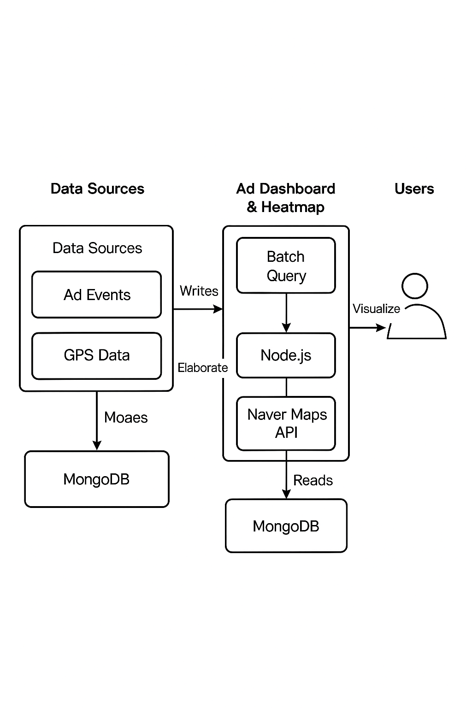

# 🚀 2025 Advertisement Data Engineering Projects

본 저장소는 2025년 수행한 광고 데이터 기반 백엔드·데이터 엔지니어링 프로젝트 전체를 정리합니다.

## 📌 Overview
하루 4~6M 규모의 광고·GPS 로그를 처리하는 시스템을 구축했습니다.
파티셔닝 기반 데이터 엔진, 광고 대시보드 성능 개선, GPS 히트맵 구축 등을 포함합니다.

## ⭐ Key Highlights
- 4~6M/day 로그 처리 위한 MySQL 파티셔닝 자동화
- 파티션 생성·백업·삭제 100% 자동화
- 통계 정확도 10~15% 향상 (중복 제거)
- GPS 집계 2~5초 / 조회 50~100ms
- 샘플링 편향(IPW) 기반 보정 설계
- Naver Maps 기반 광고 히트맵 페이지 개발

---

## 🔧 Architecture

---

## 📁 Documentation
모든 상세 문서는 `/docs` 폴더에 정리되어 있습니다.

- `partitioning.md` — 로그 파티셔닝 및 자동화
- `dashboard_performance.md` — 광고 대시보드 성능 개선
- `mongo_sync.md` — 외부 Mongo → NKS MongoDB 동기화
- `gps_heatmap.md` — GPS 기반 광고 히트맵 구축

---
